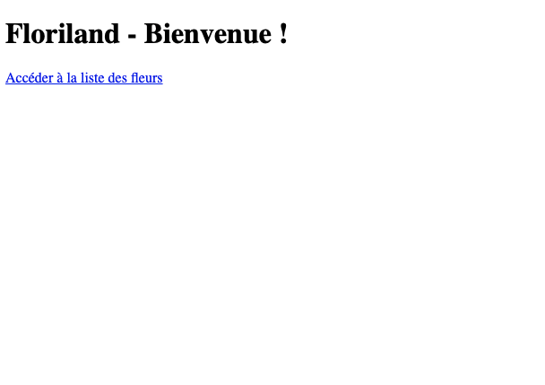
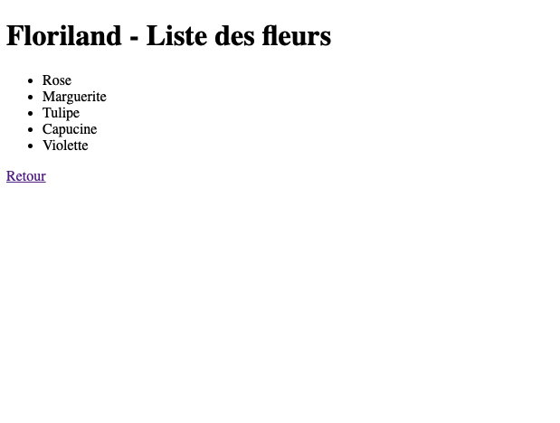

# Floriland

Après avoir découvert les bases du framework Express, place à la pratique !

Notre cliente, une fleuriste qui s'appelle Aude Épine a besoin d'un site vitrine présentant les fleurs disponibles dans son magasin.

Le designer nous a envoyé les maquettes, le site fera deux pages ressemblant à ça :




## Étape 0 - Dossier de travail

Le dépôt `Ocode` contient déjà toutes les dépendances possibles et imaginables déjà installée...

Histoire de pratiquer un peu, on se propose de :
- Créer un dossier `floriland` à part sur votre machine (à l'endroit de ton choix)
- Initialiser `git` dans ce dossier (`git init`)
- (bonus) et éventuellement le mettre sur GitHub dans ton organisation perso ou celle de ta promotion !

## Étape 1 - Mise en place

On va commencer par mettre en place notre projet NPM et une architecture Express.

### 1 : Initialiser le projet NPM
Avant tout, il faut initialiser le projet NPM. On vérifie après que le fichier `package.json` est bien créé !
<details><summary>Aide</summary>

- Pour initialiser un projet NPM, on utilise <code>npm init -y</code>.
</details>

### 2 : Installer le paquet express
On va avoir besoin du paquet NPM `express`. Après installation, on vérifie encore qu'il se trouve bien dans les `dependencies` du fichier `package.json`.
<details><summary>Aide</summary>

- Pour installer une dépendance dans un projet NPM, on utilise <code>npm install nom-du-paquet</code>
</details>

### 3 : Créer le serveur de base
Maintenant que notre projet NPM est installé, on va faire une première route ! 
- Créer un fichier `server.js` 
- Y importer `express` 
- Créer un serveur `express` qui écoute sur le port 3000 :
  -  quand on accède à http://localhost:3000/ , on souhaite afficher le message `"Serveur ok."` au client. 

<details><summary>Aide</summary>

- Récupérer le paquet npm avec <code>import</code>

- Créer le serveur express avec <code>express()</code> et l'assigner à une variable

- Ajouter une route <code>app.get(...)</code> qui répond à la route '/'

- Retourner la réponse demandée ("Serveur ok.") avec <code>response.send(...)</code>
</details>

## Étape 2 - Route index

Nous allons améliorer la route créée précédemment pour coller aux maquettes.
Il faudra renvoyer une page HTML qui contient une balise h1 `"Floriland - Bienvenue !"`.

<details><summary>Aide</summary>

- Créer un fichier `index.html` correspondant à la vue demandée

- Pour renvoyer ce fichier HTML à notre navigateur, il faudra utiliser <code>res.sendFile(...)</code> dans la route.
</details>

## Étape 3 - Route liste 

On va afficher une nouvelle vue quand l'utilisateur navigue vers http://localhost:3000/fleurs

### Etape 3.1. Liste des fleurs

Commençons par se doter d'une liste de fleurs, que l'on exporte ! Dans un nouveau fichier `flowers.js`, ajouter la liste de fleurs suivante :


```js
export const flowers = [
  'Rose',
  'Marguerite',
  'Tulipe',
  'Capucine',
  'Violette'
];
```

### Etape 3.2. Page des fleurs 

Dans le fichier `server.js`, on veut maintenant importer le tableau de fleur, et boucler dessus afin d'afficher toutes les fleurs sur la page. 
Attention, il y a un petit piège ! Dans ce cas on ne pourra pas utiliser un simple fichier `html`, il faudra faire autrement :wink:.

<details><summary>Aide</summary>

- Récupérer le fichier contenant les fleurs avec un <code>import { fleurs } from "..."</code> en haut de notre fichier `server.js`

- Créer une nouvelle route <code>app.get(...)</code>

- Créer une variable <code>let htmlResponse = ''</code>

- Remplir cette variable avec le code HTML nécessaire au début du fichier (header, ouverture du body, ouverture de la balise <code>ul</code>...)

- Boucler sur le tableau <code>fleurs</code> récupéré au dessus pour ajouter les <code>li</code> contenant les noms des fleurs à la variable <code>htmlResponse</code>

- Ajouter à la variable <code>htmlResponse</code> la fin du HTML (fermeture de la balise <code>ul</code>, fermeture du body, html...)

- Renvoyer <code>htmlResponse</code> avec <code>res.send(...)</code>.
</details>

<details><summary>
Note
</summary>
Bientôt, apprendra comment passer des variables JavaScript vers une vue codée en HTML :tada:
</details>

## Étapes bonus

Déjà fini ? C'est pas fini ! Voilà des petites idées bonus !

- Ajouter des liens pour naviguer entre les deux pages.

- Ajouter du CSS pour les deux pages (pas d'idée ? background en #F0F !)

- Méga bonus de la mort : rendre cliquables les fleurs pour amener sur une route paramétrée /fleurs/:nomFleur qui prend le nom de la fleur en paramètre et affiche "Vous avez choisi la fleur : (nomFleur) !"
